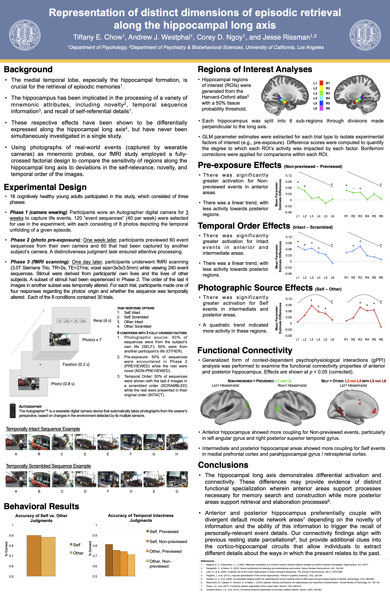

# Representation of Distinct Dimensions of Episodic Retrieval Along the Hippocampal Long Axis

**Conference:** International Conference on Memory (ICOM) | Budapest, Hungary

**Contributions:** Lead researcher and first author. Designed the 3-phase experimental paradigm, programmed the functional magnetic resonance imaging (fMRI) task in MATLAB (customizing individualized stimuli and scan-synchronized response collection), performed primary neuroimaging and behavioral data collection, conducted all analyses in MATLAB and SPSS, developed primary data visualizations, and authored the presentation materials.

**Keywords:** Functional Magnetic Resonance Imaging (fMRI), Functional Connectivity, Generalized Context-Dependent Psychophysiological Interaction (gPPI), Parameter Extraction, Hippocampal Long Axis, Wearable Camera Technology, Experimental Design, Episodic Memory

---

## Summary

* **Problem:** The hippocampus is critically involved in episodic memory retrieval, including processing diverse memory attributes such as self-referential details, novelty, and temporal sequence. However, it is unknown how these dimensions are simultaneously mapped along its functional anterior-to-posterior axis during real-world memory retrieval.
* **Approach:** Employed a fully-crossed, 3-factor fMRI experimental design utilizing naturalistic event sequences captured from participants' lives over 3 weeks via wearable digital cameras. General linear model (GLM) parameter estimates were extracted as measures of activation from 6 bilateral hippocampal sub-regions, and generalized context-dependent psychophysiological interaction (gPPI) analyses were conducted to map the functional connectivity of the anterior and posterior hippocampus.
* **Takeaway:** Hippocampal long axis regions display distinct functional specialization and connectivity profiles. **Anterior hippocampal regions** responded to novelty and temporal intactness (*potentially reflecting memory search and construction mechanisms*), whereas **intermediate and posterior hippocampal regions** were driven by personally experienced events (*potentially reflecting retrieval and elaboration mechanisms*).

---

