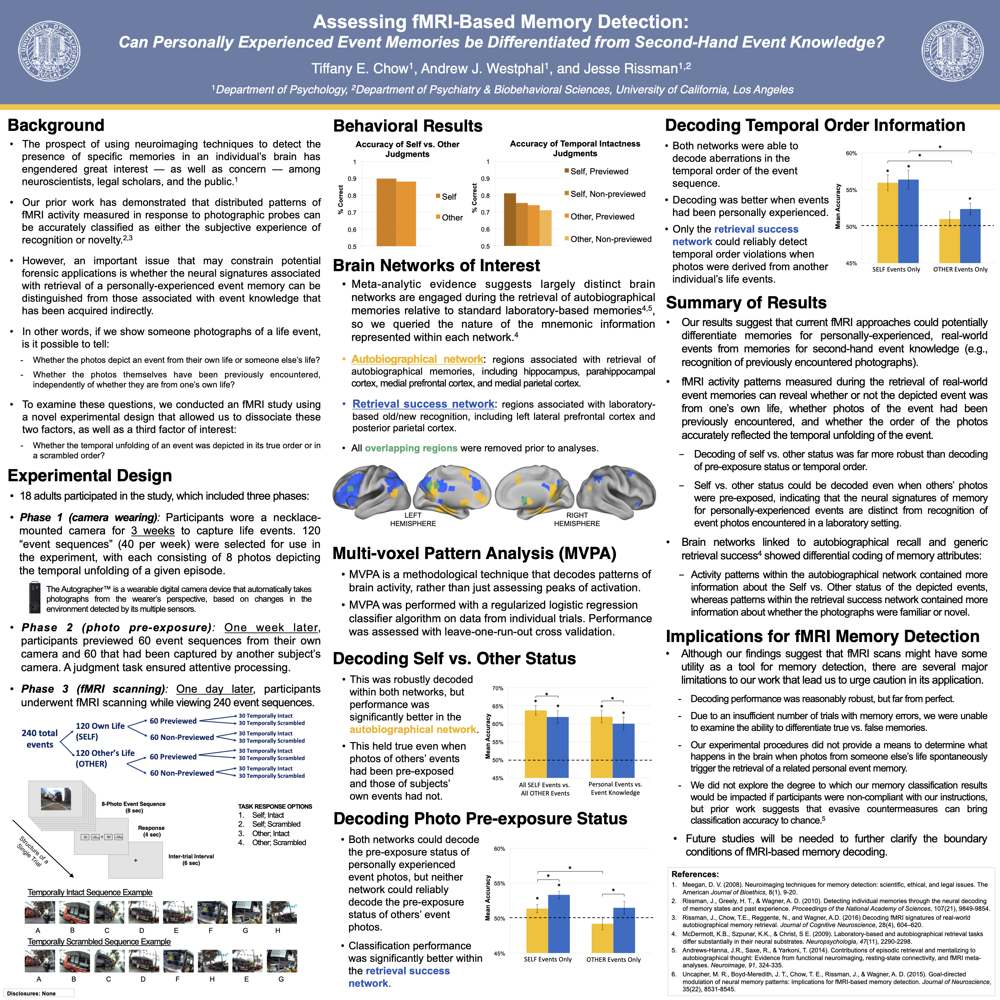

# Assessing fMRI-Based Memory Detection: Can Personally Experienced Event Memories Be Differentiated from Second-Hand Event Knowledge?

**Conference:** International Neuroethics Society (INS) Annual Meeting | San Diego, CA, USA  

**Recognition:** Awarded **"Top Abstract"** at the conference and published in *The American Journal of Bioethics Neuroscience*  

**Contributions:** Lead researcher and first author. Designed the 3-phase experimental paradigm, programmed the functional magnetic resonance imaging (fMRI) task in MATLAB (customizing individualized stimuli and scan-synchronized response collection), performed primary neuroimaging and behavioral data collection, conducted all analyses in MATLAB and SPSS, developed primary data visualizations, and authored the final publication and presentation materials.

**Keywords:** Functional Magnetic Resonance Imaging (fMRI), Machine Learning Classification, Multi-Voxel Pattern Analysis (MVPA), Regularized Logistic Regression (RLR), Wearable Camera Technology, Experimental Design, Episodic Memory, Neuroethics  

---

## Summary

* **The Problem:** Investigated the granularity of fMRI machine learning models in classifying memory retrieval experiences, an essential distinction for potential legal and forensic memory detection. Can these models distinguish true, personally experienced life events from second-hand familiarity?
* **The Approach:** Combined a 3-week naturalistic stimulus collection protocol using wearable digital cameras with an fMRI memory retrieval task to simulate real-world event recall. Applied multi-voxel pattern analysis (MVPA) with a regularized logistic regression (RLR) classifier algorithm within targeted functional brain networks.
* **The Takeaway:** Demonstrated brain network functional specialization such that regions in the **Autobiographical Network** decoded the source of memories (*Self vs. Other*) while areas in the **Retrieval Success Network** decoded prior image familiarity (*Previewed vs. Non-Previewed*). This established preliminary empirical boundary conditions for legal and forensic applications of fMRI memory detection.

---

