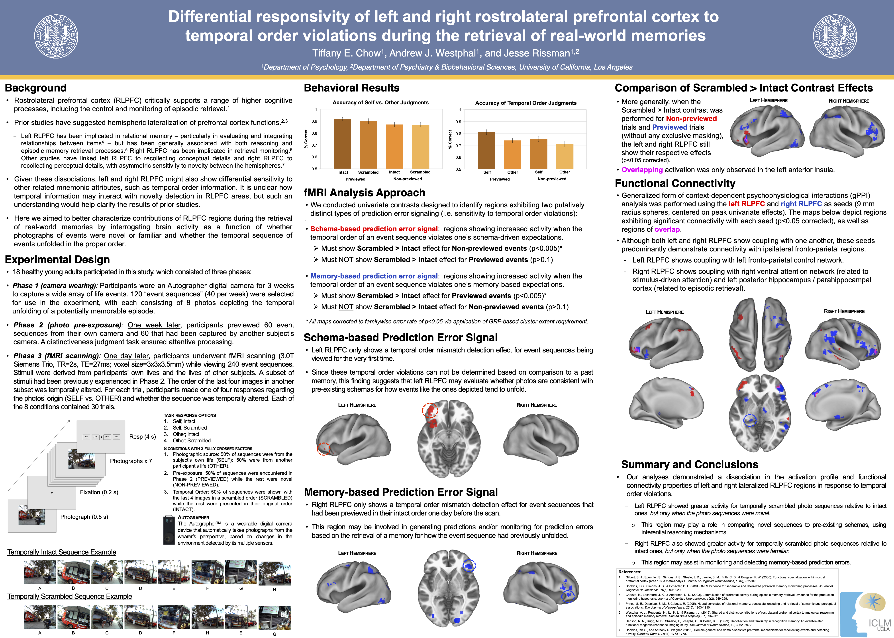

# Differential Responsivity of Left and Right Rostrolateral Prefrontal Cortex to Temporal Order Violations During the Retrieval of Real-World Memories

**Conference:** Society for Neuroscience (SfN) Annual Meeting | San Diego, CA, USA  

**Contributions:** Lead researcher and first author. Designed the 3-phase experimental paradigm, programmed the functional magnetic resonance imaging (fMRI) task in MATLAB (customizing individualized stimuli and scan-synchronized response collection), performed primary neuroimaging and behavioral data collection, conducted all analyses in MATLAB and SPSS, developed primary data visualizations, and authored the final publication and presentation materials.

**Keywords:** Functional Magnetic Resonance Imaging (fMRI), Functional Connectivity, Generalized Context-Dependent Psychophysiological Interaction (gPPI), Rostrolateral Prefrontal Cortex (RLPFC), Hemispheric Lateralization, Prediction Error, Wearable Camera Technology, Experimental Design, Episodic Memory  

---

## Summary

* **Problem:** The rostrolateral prefrontal cortex (RLPFC) facilitates episodic memory retrieval, including control and monitoring processes, with prior studies suggesting functional hemispheric lateralization. However, it is unclear how temporal sequence information may interact with novelty detection in these regions to impact prediction error signaling during the retrieval of real-world memories.
* **Approach:** Implemented a 3-phase fMRI experimental design employing naturalistic event sequences taken from participants' lives over 3 weeks via wearable digital cameras. Conducted general linear model (GLM) univariate contrasts to identify distinct types of prediction error signaling in response to temporal order violations (intact vs. scrambled sequences) as well as generalized context-dependent psychophysiological interaction (gPPI) analyses using the left and right RLPFC to assess functional connectivity.
* **Takeaway:** Demonstrated divergent activation and functional connectivity profiles of the RLPFC hemispheres. The **left RLPFC** detected temporal order violations in *novel* sequences (*potentially reflecting schema-based prediction errors*), while the **right RLPFC** detected temporal order violations in *previously encountered* sequences (*potentially reflecting memory-based prediction errors*). 

---

