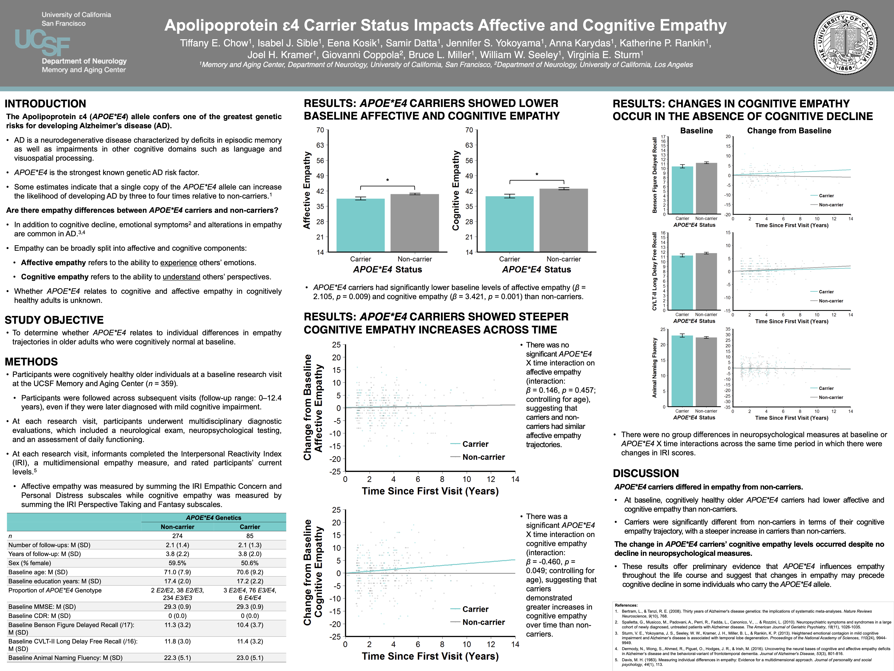

# Apolipoprotein ɛ4 Carrier Status Impacts Affective and Cognitive Empathy

**Conference:** Society for Neuroscience (SfN) Annual Meeting | 2018 | San Diego, CA, USA

**Contributions:** Lead researcher and first author. Investigated core research question and operationalized the analytical design, curated the dataset by defining inclusion criteria and aggregating data (genetic and behavioral), conducted all statistical modeling and data visualizations in R, and authored the presentation materials.

**Keywords:** Longitudinal Behavioral Trajectory Modeling, Trajectory Forecasting, Multivariate Linear Regression, Mixed-Effects Modeling, Cohort Stratification, Alzheimer's Disease, Apolipoprotein ɛ4 (APOE\*E4), Genetic Risk Factors, Neurodegenerative Disorder, Affective Empathy, Cognitive Empathy, Interpersonal Reactivity Index (IRI)

---

## Summary

* **Problem:** Alzheimer's disease (AD) is a neurodegenerative disorder that commonly involves alterations in empathy. The Apolipoprotein ɛ4 (APOE\*E4) allele is the strongest genetic risk factor for developing AD, but it is not known whether APOE\*E4 impacts individual differences in affective and cognitive empathy trajectories in healthy older adults.
* **Approach:** Evaluated a large cohort of cognitively healthy older adults (*n* = 359) over a longitudinal follow-up period (ranging up to 12.4 years) that included multiple informant ratings of empathy from the Interpersonal Reactivity Index (IRI) measure. Analyzed socioemotional differences between APOE\*E4 carriers and non-carriers by conducting multivariate linear regressions to assess baseline empathy levels between groups as well as longitudinal multivariate mixed-effects linear regressions modeling the interaction between APOE\*E4 carrier status and time to assess empathy trajectories as well as neuropsychological performance.
* **Takeaway:** APOE\*E4 exerts a long-term influence on empathy. APOE\*E4 carriers not only exhibited **significantly lower baseline affective and cognitive empathy** compared to non-carriers, but carriers also demonstrated a **steeper increase in cognitive empathy across time**, which occurred in the complete absence of concurrent cognitive decline. This suggests that *socioemotional changes may take place prior to cognitive decline in individuals with genetic AD risk*, highlighting potential early behavioral markers.

---

