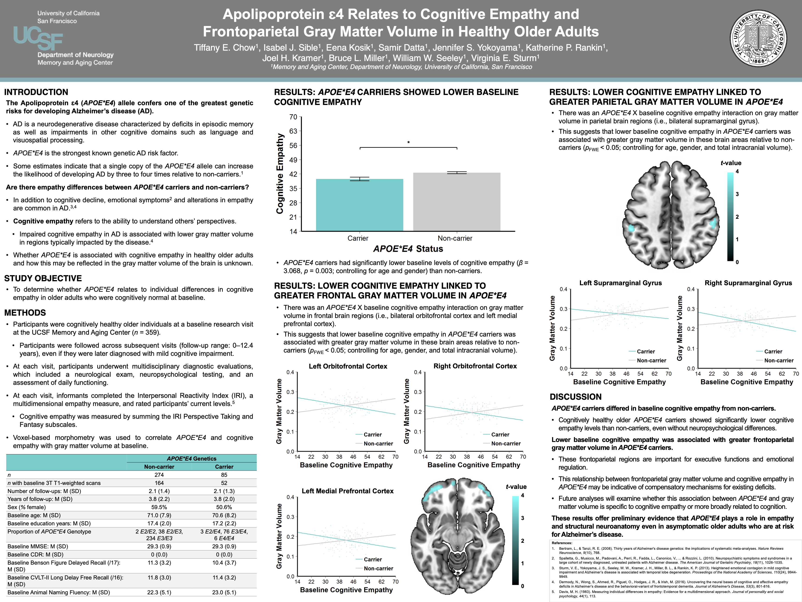

# Apolipoprotein ɛ4 Relates to Cognitive Empathy and Frontoparietal Gray Matter Volume in Healthy Older Adults

**Conference:** Bay Area Affective Science (BAAS) | 2019 | Poster Presentation | San Francisco, CA, USA

**Contributions:** Lead researcher and first author. Investigated core research question and operationalized the analytical design, curated the dataset by defining inclusion criteria and aggregating data (neuroimaging, genetic, and behavioral), conducted all statistical modeling and voxel-based morphometry (VBM) analyses in R and MATLAB, developed all data visualizations, and authored the presentation materials.

**Keywords:** Voxel-Based Morphometry (VBM), Magnetic Resonance Imaging (MRI), Multivariate Linear Regression, Cohort Stratification, Gray Matter Volume, Alzheimer's Disease, Apolipoprotein ɛ4 (APOE\*E4), Genetic Risk Factors, Neurodegenerative Disorder, Social Cognition, Cognitive Empathy, Interpersonal Reactivity Index (IRI)

---

## Summary

* **Problem:** Changes in empathy commonly occur in Alzheimer's disease (AD), and the Apolipoprotein ɛ4 (APOE\*E4) allele is one of the greatest genetic risk factors for developing this neurodegenerative disorder. It is unclear whether APOE\*E4 is associated with individual differences in cognitive empathy in healthy older adults, and how this may be reflected in the structural neuroanatomy of the brain.
* **Approach:** Evaluated a large cohort of cognitively healthy older adults (*n* = 359) with informant ratings of empathy from the Interpersonal Reactivity Index (IRI) measure, a subset of which also had baseline magnetic resonance imaging (MRI) scans (*n* = 216). Evaluated differences between APOE\*E4 carriers and non-carriers by modeling a multivariate linear regression to assess baseline empathy between groups and conducted voxel-based morphometry (VBM) analyses to correlate APOE\*E4 carrier status and baseline cognitive empathy with gray matter volume.
* **Takeaway:** APOE\*E4 relates to both empathy and underlying neuroanatomy. Cognitively healthy APOE\*E4 carriers exhibited **significantly lower baseline cognitive empathy** than non-carriers. Furthermore, lower cognitive empathy in carriers was associated with **greater gray matter volume** in frontoparietal regions that support *emotional regulation and executive functions*, which may reflect compensatory mechanisms for existing deficits in asymptomatic individuals with genetic AD risk.

---

