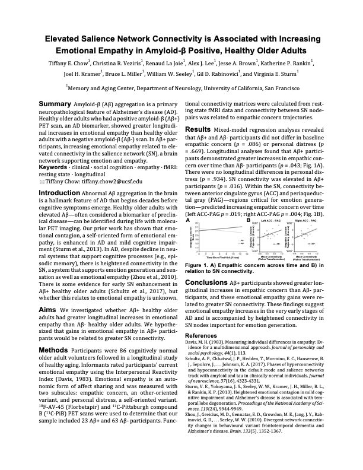

# Elevated Salience Network Connectivity is Associated with Increasing Emotional Empathy in Amyloid-β Positive, Healthy Older Adults

**Conference:** Society for Affective Science (SAS) | 2021 | Digital Abstract and Video Presentation | Virtual

**Contributions:** Lead researcher and first author. Investigated core research question and operationalized the analytical design, curated the dataset by defining inclusion criteria and aggregating data (neuroimaging, genetic, and behavioral), conducted all statistical modeling and functional connectivity analyses in R and MATLAB, developed all data visualizations, and authored the presentation materials.

**Keywords:** Task-Free Functional Magnetic Resonance Imaging (tf-fMRI), Positron Emission Tomography (PET), Functional Connectivity, Longitudinal Behavioral Modeling, Trajectory Forecasting, Mixed-Effects Modeling, Multivariate Linear Regression, Forward-Selection Hierarchical Regression, Cohort Stratification, Alzheimer's Disease, Amyloid-β, Apolipoprotein ɛ4 (APOE\*E4), Biomarker, Neurodegenerative Disorder, Social Cognition, Emotional Empathy, Interpersonal Reactivity Index (IRI)

---

## Summary

* **Problem:** Abnormal Amyloid-β (Aβ) aggregation is a characteristic of Alzheimer’s disease (AD) that accumulates decades prior to overt cognitive symptoms. Individuals with symptomatic AD exhibit both enhanced emotional empathy and heightened connectivity in the brain's salience network (SN), a system of regions that support emotional processes. It is not understood whether cognitively healthy individuals with elevated Aβ also experience similar socioemotional shifts linked to underlying SN changes.

* **Approach:** Evaluated a cohort of 86 cognitively healthy older adults participating in a longitudinal aging study, stratifying them into positive Aβ (Aβ+; *n* = 23) and negative Aβ (Aβ-; *n* = 63) groups using molecular positron emission tomography (PET) imaging. Conducted multivariate mixed-model regressions to evaluate longitudinal group differences in emotional empathy via informant ratings on the Interpersonal Reactivity Index (IRI) measure as well as SN connectivity. Forward-selection hierarchical regression analyses were applied to assess SN functional connectivity features that predicted individual empathy changes over time.

* **Takeaway:** Aβ relates to both heightened emotional empathy and brain network connectivity in cognitively normal older adults. Although the two groups displayed similar empathy levels at baseline, the Aβ+ cohort experienced **significantly steeper longitudinal gains in emotional empathy**, which was **predicted by hyperconnectivity between key SN areas**. These findings suggest that rising emotional empathy may serve as a *very early preclinical indicator of AD pathology*, driven by *functional alterations in emotion-generating neural circuits*.

---

View the abstract submission below, and click to view the high-resolution PDF.

